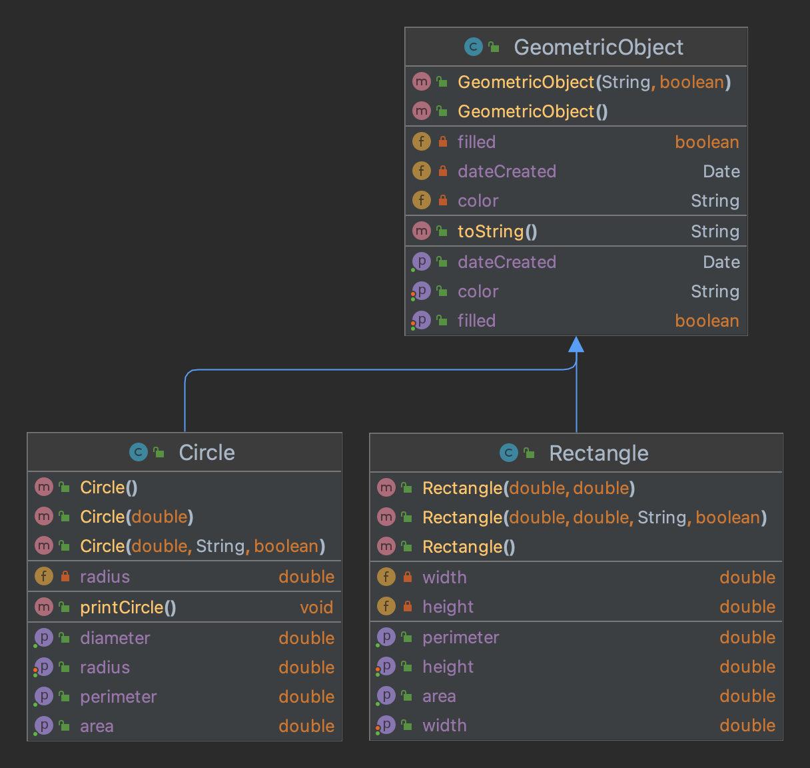

# Практическая работа №7

### Немного теории по наследованию
Рассмотрим геометрические фигуры. Нам требуется создать классы для моделирования геометрических фигур, таких как круги и прямоугольники. У геометрических фигур есть много общих свойств и вариантов поведения. Они могут быть определенного цвета, закрашенными или незакрашенными.
Таким образом, общий класс `GeometricObject` можно использовать для моделирования всех геометрических фигур. Этот класс содержит свойства цвет `color` и заливка `filled`, а также соответствующие им **getter-** и **setter-методы**.
Этот класс также содержит свойство `dateCreated` и методы `getDateCreated()` и `toString()`. Метод `toString()` возвращает строковое представление объекта.
Поскольку круг является конкретным типом геометрической фигуры, он имеет общие свойства и методы с другими геометрическими фигурами. Таким образом, имеет смысл определить класс `Circle`, который будет порожден от класса `GeometricObject`.
Аналогично, класс `Rectangle` также можно определить как конкретный тип класса `GeometricObject`.



Класс `Rectangle` наследует все поля данных и методы класса `GeometricObject`.
Кроме того, у него есть поля данных `width` и `height` и связанные с ними **getter-** и **setter-методы**.
Он также содержит методы `getArea()` и `getPerimeter()` для возврата площади и периметра прямоугольника.

Класс `Circle` порождается от класса `GeometricObject` с помощью следующего синтаксиса:
```JAVA
//Circle это подкласс, а GeometricObject - суперкласс
public class Circle extends GeometricObject{
    ...
}
```
Ключевое слово `extends` сообщает компилятору, что класс `Circle` порождается от класса `GeometricObject`, наследуя таким образом методы `getColor()`, `setColor()`, `isFilled()`, `setFilled()` и `toString()`.
Перегруженный конструктор `Circle` реализуется путем вызова методов `setColor()` и `setFilled()` для присваивания свойств **color** и **filled**.
**Public-методы**, определенные в суперклассе `GeometricObject`, наследуются подклассом `Circle`, поэтому их можно использовать в `Circle`.

### Небольшая теория по основам исключений
Обработка исключений в Java — один из мощных механизмов обработки ошибок времени выполнения, позволяющий поддерживать нормальный поток работы приложения.
В Java исключение — это событие, которое нарушает нормальный ход программы. Это объект, который выбрасывается во время выполнения.

Java предоставляет пять ключевых слов, которые используются для обработки исключений.

| Слово   | Описание |
|---------|----------|
| try     | Ключевое слово "try" используется для указания блока, в который мы должны поместить код исключения. Это означает, что мы не можем использовать блок try в одиночку. За блоком try должен следовать либо catch, либо finally.         |
| catch   | Блок "catch" используется для обработки исключения. Ему должен предшествовать блок try, что означает, что мы не можем использовать блок catch отдельно. За ним может следовать блок finally позже.         |
| finally | Блок "finally" используется для выполнения необходимого кода программы. Он выполняется независимо от того, обработано исключение или нет.         |
| throw   | Ключевое слово «throw» используется для создания исключения.         |
| throws  | Ключевое слово "throws" используется для объявления исключений. Оно указывает, что в методе может возникнуть исключение. Оно не выбрасывает исключение. Оно всегда используется с сигнатурой метода.         |

Рассмотрим пример обработки исключений Java, в котором мы используем оператор try-catch для обработки исключения.
```JAVA
public class JavaExceptionExample{  
  public static void main(String args[]){  
   try{  
      //код, который может вызвать исключение
      int data=100/0;  
   }catch(ArithmeticException e){System.out.println(e);}  
   //остальной код программы
   System.out.println("остальной код...");  
  }  
}  
```
```TEXT
Exception in thread main java.lang.ArithmeticException:/ by zero rest of the code...
```
В приведенном выше примере 100/0 вызывает исключение ArithmeticException, которое обрабатывается блоком try-catch.

## Задание №1

Создайте класс `Triangle` для представления треугольников, который порождается от класса `GeometricObject`.
Напишите клиент этих классов — программу, которая запрашивает у пользователя ввести три стороны треугольника, **цвет** и **логическое значение** для указания _закрашен ли треугольник_. Программа должна создавать **объект типа** `Triangle` с указанными сторонами и присваивать значения свойствам цвет `color` и заливка `isFilled` с помощью этих входных данных. Программа должна отображать площадь `area`, периметр `perimeter`, **цвет**, а также **true** или **false** для указания, закрашен треугольник или нет.

Класс **Triangle** должен содержать:
* Три поля данных типа double с именами `side1`, `side2` и `side3` и с заданными по умолчанию значениями, равными **1.0**, для обозначения трех сторон треугольника.
* Безаргументный конструктор, который создает треугольник с заданными по умолчанию значениями.
* Конструктор, который создает треугольник с `side1`, `side2` и `side3`.
* Getter-методы для всех трех полей данных.
* Метод с именем `getArea()`, который возвращает площадь этого треугольника.
* Метод с именем `getPerimeter()`, который возвращает периметр этого треугольника.
* Метод с именем `toString()`, который возвращает строковое описание треугольника.

Формулы для вычисления площади треугольника:
$$s = (side1 + side2 + side3)/2$$
$$area\sqrt{s(s-side1)(s-side2)(s-side3)}$$

где $s$ — полупериметр, а $area$ — площадь треугольника.

Метод `toString()` должен быть реализован следующим образом:
```JAVA
return "Треугольник: сторона1 = " + side1 + " сторона2 = " + side2 +
  " сторона3 = " + side3;
```

## Задание №2
В треугольнике сумма длин любых двух сторон больше длины третьей стороны.
Класс `Triangle` должен удовлетворять этому правилу.
Создайте класс `IllegalTriangleException` и измените конструктор класса `Triangle`, чтобы выбросить объект типа `IllegalTriangleException`, если треугольник создан со сторонами, нарушающими это правило, следующим образом:
```JAVA
/** Создает треугольник с указанными сторонами */
public Triangle(double side1, double side2, double side3)
  throws IllegalTriangleException {
  // Тут надо написать реализацию исключения
}
```

## Задание №3
Спроектируйте новый класс `Triangle`, который наследуется от абстрактного класса `GeometricObject`.
1. Напишите тестовую программу, которая запрашивает у пользователя ввод трёх сторон треугольника, цвета и логического значения для указания заливки.
2. Программа должна создать объект типа `Triangle` с этими сторонами и задать свойства **color** и **filled**, используя введенные пользователем данные.
3. Программа должна отображать **площадь**, **периметр**, **цвет** и значение **true** или **false** для указания заливки.
4. Реализуйте в классе `GeometricObject` интерфейс `Comparable` и определите статический метод `max()` в классе `GeometricObject` для поиска наибольшего из двух объектов типа `GeometricObject`.
5. Проверьте тестовой программой работу метода `max()` для поиска наибольшего из двух кругов и наибольшего из двух прямоугольников.
6. Вернитесь к классу с именем `ComparableCircle`, который наследуется от `Circle` и реализует `Comparable`. Напишите тестовую программу, чтобы найти наибольший из двух экземпляров класса `ComparableCircle` и наибольший между кругом и прямоугольником, используя метод `compareTo()`.

## Задание №4
1. Создайте интерфейс с именем `Colorable` с помощью метода `howToColor()` типа `void`.
Каждый класс раскрашиваемого объекта должен реализовывать интерфейс `Colorable`.
2. Спроектируйте класс `Square`, который наследуется от `GeometricObject` и реализует `Colorable`.
Реализуйте метод `howToColor()` для отображения сообщения: _Раскрасьте все четыре стороны_.
3. Класс `Square` содержит поле данных `side` с **getter-** и **setter-методами**, а также конструктор для создания `Square` с указанной стороной.
У класса `Square` есть **скрытое** поле данных типа `double` с именем `side` и **getter-** и **setter-методами**.
У него есть **безаргументный конструктор**, который создает объект типа `Square` со стороной, равной **0**, и еще один конструктор, который создает объект типа `Square` с указанной стороной.
4. Напишите тестовую программу, которая создает массив из пяти объектов типа `GeometricObjects`.
Для каждого объекта в массиве отобразите его площадь и вызовите метод `howToColor()`, если его можно раскрасить.