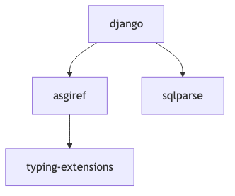
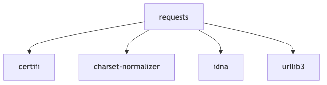

# Вариант №4

**Задание №2**

Разработать инструмент командной строки для визуализации графа зависимостей, включая транзитивные зависимости. Сторонние средства для получения зависимостей использовать нельзя.
Зависимости определяются по имени пакета языка Python (pip). Для описания графа зависимостей используется представление Mermaid. Визуализатор должен выводить результат в виде сообщения об успешном выполнении и сохранять граф в файле формата png. Ключами командной строки задаются:
- Путь к программе для визуализации графов.
- Имя анализируемого пакета.
- Путь к файлу с изображением графа зависимостей.
- URL-адрес репозитория.

Все функции визуализатора зависимостей должны быть покрыты тестами.

----
**Запуск программы**

Для того чтобы запустить программу, используйте следующую команду:
```
python dependency_visualizer.py \
    --visualizer-path /opt/homebrew/bin/mmdc \
    --package-name requests \
    --output-file graph.png \
    --repo-url https://pypi.org/project/requests/
```
Где:

- ```--visualizer-path```: Путь к инструменту для генерации графа (например, [Mermaid CLI](https://github.com/mermaid-js/mermaid-cli)). Убедитесь, что инструмент установлен и доступен по указанному пути.
- ```--package-name```: Имя пакета, зависимости которого вы хотите визуализировать (например, ```requests```).
- ```--output-file```: Имя файла для сохранения графа (например, ```graph.png```).
- ```--repo-url```: URL репозитория на GitHub, откуда будет извлечена информация о зависимостях (например, ```https://github.com/psf/requests```).
----
**Проверка зависимостей пакета**

Чтобы проверить зависимости для конкретного пакета, используйте команду:
```
pip show requests
```
Это отобразит информацию о пакете, включая раздел "Requires", который содержит список зависимостей этого пакета.

----
**Примечания**

1. Убедитесь, что у вас установлен [Mermaid CLI](https://github.com/mermaid-js/mermaid-cli) для генерации графов.
2. Убедитесь, что у вас установлен пакет pip и все необходимые библиотеки Python.

**Пример использования**

```
python dependency_visualizer.py \
    --visualizer-path /Users/arcmrx/.npm-global/bin/mmdc \
    --package-name django \  
    --output-file graph.png \ 
    --repo-url https://pypi.org/project/Django/
```



```
python dependency_visualizer.py \
    --visualizer-path /Users/arcmrx/.npm-global/bin/mmdc \
    --package-name requests \
    --output-file graph1.png \
    --repo-url https://pypi.org/project/requests/
```

